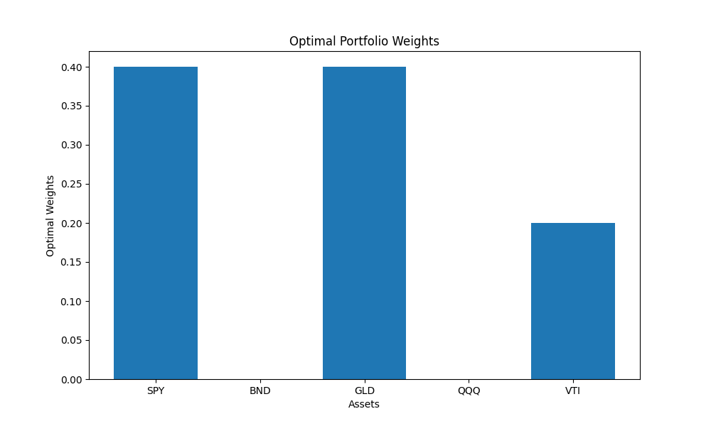

# Advanced Markowitz Portfolio Optimization

Python-based application for optimizing multi-asset portfolios using Modern Portfolio Theory (Markowitz Framework), with realistic constraints and noisy real-world financial data.

## Objective
To find efficient portfolio allocations that maximize the Sharpe ratio while accounting for risk-return trade-offs, under practical constraints (allocation bounds, missing values, stock splits, dividends, etc.).

## ETFs Used
- SPY (US Equity ETF)
- BND (Bond ETF)
- GLD (Gold ETF)
- QQQ (Tech Equity ETF)
- VTI (Total Stock Market ETF)

## What the script does
- Downloads historical price data and computes log-returns
- Calculates covariance matrix and annualized returns
- Simulates over 10,000 random portfolios
- Plots the efficient frontier
- Identifies the portfolio with maximum Sharpe ratio

## Example Outputs

**Optimal Portfolio:**  

**Optimal Weights:**  

## Technologies
- Python (pandas, numpy, matplotlib)
- Financial data handling
- Monte Carlo simulation

## What I learned
- Practical implementation of quantitative portfolio theory
- Handling imperfect financial data and corporate actions
- Visualization of risk-return trade-offs

---

Created by Alice Proietti

